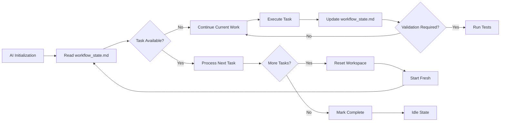

# README.md

# Cursor Natural AI Workflow 


## Overview

Transform your Cursor AI assistant into a true development partner with persistent memory and structured workflows. This system eliminates repetitive explanations and provides consistent, focused assistance by maintaining context throughout your development process.

### Key Benefits

- **Persistent Memory**: Your AI remembers project context and coding preferences
- **Structured Workflows**: Follows a logical progression from analysis to validation
- **Batch Processing**: Handles multiple tasks systematically without losing context
- **Plan Archiving**: Never lose track of your development plans and decisions
- **Git Integration**: Built-in version control support for better collaboration

## How It Works

The system utilizes just two configuration files to manage your AI's behavior:

### `project_config.md`
Your project's long-term memory containing:
- Project goals and requirements
- Technology stack and tool preferences
- Coding standards and patterns
- Performance constraints
- Token management settings

### `workflow_state.md`
The dynamic workspace that tracks:
- Current workflow phase
- Implementation plans and rules
- Activity logs and tool usage
- Task queues and results
- Historical blueprints for reference

## Workflow Process



## Development Phases

1. **Understanding**: Requirements analysis without premature solutioning
2. **Planning**: Detailed step-by-step implementation with blueprint archiving
3. **Building**: Precise execution with error handling and systematic processing
4. **Validation**: Testing and verification against requirements

## Getting Started

1. **Locate Configuration Files**: Find `project_config.md` and `workflow_state.md` in the `cursorkleosr/` directory
2. **Configure Project**: Customize `project_config.md` with your project specifics
3. **Initialize AI**: Use this system prompt in Cursor:
   ```
   You're an autonomous AI developer. Work exclusively with project_config.md and workflow_state.md. 
   Before each action, read workflow_state.md to understand context, follow the rules, 
   then immediately update workflow_state.md with your actions and results.
   ```
4. **Begin Development**: The AI will initialize and request your first task

## Extensible MCP Framework

This workflow is designed to be extensible through the use of MCP (Multi-Agent Controller Processor) servers. MCPs are external tools or services that can be called upon by the AI agent to perform specialized tasks, such as code analysis, documentation generation, or interacting with external APIs.

This extensibility is achieved through two key files: `.mcp.json` for configuration and `workflow_state.md` for rule-based invocation.

### Configuring MCPs in `.mcp.json`

To add a new MCP, you need to define it in the `.mcp.json` file located in the root of the repository. This file contains a list of all available MCP servers and their connection details.

Here is an example of a `.mcp.json` file:

```json
{
  "mcp_servers": {
    "Firecrawl": {
      "description": "Turns websites into structured, LLM-ready data.",
      "endpoint": "http://localhost:8002/api/v1",
      "api_key": "YOUR_FIRECRAWL_API_KEY",
      "enabled": true
    },
    "CodeAnalyzer": {
      "description": "Performs static and dynamic analysis of code.",
      "endpoint": "http://localhost:8005/api/v1",
      "api_key": "YOUR_CODEANALYZER_API_KEY",
      "enabled": true
    }
  }
}
```

Each MCP entry should have:
-   `description`: A brief explanation of what the MCP does.
-   `endpoint`: The API endpoint for the MCP server.
-   `api_key`: The API key for authentication (use placeholders).
-   `enabled`: A boolean to easily enable or disable the MCP.

### Invoking MCPs with Rules in `workflow_state.md`

Once an MCP is configured, you can define rules in `workflow_state.md` to tell the AI agent when and how to use it. These rules are added to the `<!-- STATIC:RULES:START -->` section.

For example, to use the `Firecrawl` and `CodeAnalyzer` MCPs from the example above, you could add the following rules:

```markdown
### [PHASE: ANALYZE]
If input contains a URL, call FirecrawlMCP to get structured data.
Call CodeAnalyzer MCP to perform static analysis on relevant files.

### [PHASE: VALIDATE]
On success, call DocGenerator MCP to create/update documentation.
```

The AI agent will interpret these rules during the corresponding workflow phase and execute the MCP call. This rule-based approach allows for a flexible and powerful way to extend the agent's capabilities without changing its core implementation.

## Dynamic Agent Personas

To make the AI agent even more adaptable, this project includes a persona-based rule system. This allows you to dynamically change the agent's behavior and expertise by selecting a "persona" that is best suited for your project's needs (e.g., "Python Backend Developer", "Frontend Developer").

The persona system works by loading a specific set of `rulescursor` rules based on the selected persona.

### 1. Set the Active Persona

To set the active persona for your project, open the `project_config.md` file and edit the `PERSONA` section.

**Example `project_config.md`:**
```markdown
<!-- STATIC:PERSONA:START -->
## Persona
python_backend_developer
<!-- STATIC:PERSONA:END -->
```
The name you enter here must correspond to a persona defined in `persona.mcp.json`.

### 2. Define Personas in `persona.mcp.json`

The available personas and the rules they use are defined in the `persona.mcp.json` file. This file allows you to create new personas or customize existing ones.

Each persona has a list of rule files it uses. Personas can also `inherit` rules from a parent persona (like `default`), making it easy to build specialized personas.

**Example `persona.mcp.json`:**
```json
{
  "personas": {
    "default": {
      "rules": [
        "core/agent-personality.mdc",
        "tools/git-commit-message.mdc"
      ]
    },
    "python_backend_developer": {
      "inherits": "default",
      "rules": [
        "lng/python/formatting.mdc"
      ]
    }
  }
}
```
In this example, the `python_backend_developer` persona will use all the rules from the `default` persona, plus the `lng/python/formatting.mdc` rule.

### 3. Apply the Persona

After setting your desired persona in `project_config.md`, you need to run the `apply_persona.py` script to download and apply the corresponding rule set.

Run the script from your terminal:
```bash
python apply_persona.py
```
The script will read your configuration, fetch the correct rules, and place them in the `.cursor/rules` directory, ready for the AI agent to use. You should run this script whenever you change the persona.

## Key Features

### Blueprint Archiving
Every plan is automatically archived with timestamps and unique IDs. Retrieve previous plans with natural language:
- "Show me last Tuesday's blueprint"
- "Use blueprint abc123def"
- "Display this week's plans"

### Git Integration
Seamless version control support with:
- Automated commit suggestions
- Progress tracking through commit logs
- Plain English rollback and comparison commands

### Cursor Rules Integration
While `.cursorrules` can still manage global preferences, the workflow intelligence now resides in your configuration files for more context-aware behavior.

## Acknowledgments


## License

This project is licensed under the MIT License - see the LICENSE file for details.

## Contributing

We welcome contributions and improvements to this system. Please share your experiences, refinements, and creative adaptations to help enhance the development workflow for everyone.

---

**Note**: This project builds upon the concepts from `iamgrewal/cursorkleosr` while focusing on simplicity and practicality for everyday development.
```
